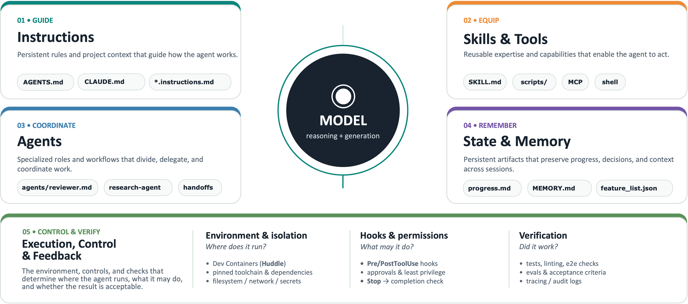
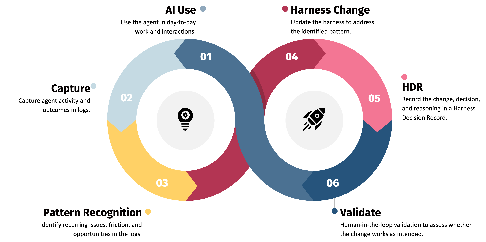

# Mission Briefing

## The situation

For the past two weeks, an AI coding agent has been working in `todo-app/`, a small
TODO app. Every session in `harness-logs/` is a real (fabricated, but realistic)
transcript from that work. The pattern across them: bugs that were already fixed keep
coming back, style keeps drifting, and a couple of sessions end with a human blocking
something the agent tried to do on its own initiative.

Nobody has actually gone back and read the transcripts. Today, that's your job.

## What's a harness?

A "harness" is everything that shapes how a coding agent behaves in a repo, beyond
the model itself:



It splits into two kinds of control:

- **Guides** steer the agent *before* it acts — instructions (`CLAUDE.md`/`AGENT.md`),
  skills, permissions.
- **Sensors** observe *after* it acts — hooks.

A harness is never finished. Guides go stale, contradict each other, or point at
files that don't exist. Sensors get registered and then quietly stop firing. None of
this throws an error — it just changes what the agent does, session after session,
until someone notices the pattern.

## Why it matters

An agent is only as reliable as the harness around it. A contradiction between two
instruction files, a hook that's been commented out, a skill with a vague
description — none of these show up as a stack trace. They show up later, as a
regression nobody can explain, or as the agent doing something nobody actually agreed
to. Safety nets you can't verify are still working aren't safety nets.

The only way to catch this is evidence: what the agent actually did, in the actual
transcripts, not what the harness *claims* it does.

## The continuous improvement loop

Fixing a harness isn't a one-off — it's a loop that keeps running for as long as the
AI system stays in use. It applies to any AI system, not just a coding agent in a
repo — a customer service AI needs the same loop:



1. **AI use.** The AI system does its actual job — here, a coding agent working in
   the repo.
2. **Capture.** Its activity and outcomes land in logs.
3. **Pattern recognition.** The agent reads those logs and spots what's recurring.
4. **Harness change.** The agent updates the harness to address it.
5. **HDR.** The agent records the change, decision, and reasoning.
6. **Validate.** The one human-in-the-loop step: a person checks the change
   actually holds up before it feeds back into step 1.


## What you'll do today

Five exercises, in order, from raw evidence to an actual reviewed and validated
harness fix. Running short on time? Take the **fast track** (~20 minutes): the
[fast-track booster](exercises/README.md#fast-track) fully completes exercises 1–2
for you, so you start exercise 3 with real `groups.json`/`analysis.json` already in
hand. The **full track** (~60 minutes) works through all five yourself.

```
harness-logs/ → [1: Group] → groups.json → [2: Analyze] → analysis.json
  → [3: Implement] → PR (diff) → [4: Document] → PR (+ HDR)
  → [5: Validate] → PR (+ validation) → human approves
```

1. **Group.** Cluster sessions in `harness-logs/` by real shared cause, not shared
   vocabulary — each group names a specific harness component.
2. **Analyze.** Turn those groups into real findings: why it matters, a concrete
   recommendation, a confidence level.
3. **Implement.** Change the harness — through an agent deliberately denied write
   access to this app's production code. You design what tool access it needs.
4. **Document.** Record *why* the harness changed, in the same pull request as the
   change itself.
5. **Validate.** Check the change against its evidence and its record before it's
   approved.

## Ground rules

- **Read before concluding.** A finding without a session ID attached is a guess.
- **Name the specific thing.** "Something seems off" isn't a finding.
- **Propose, don't apply.** A human always decides what actually changes.

## Next

Head to [`exercises/exercise-1-analysis-skill.md`](exercises/exercise-1-analysis-skill.md).
